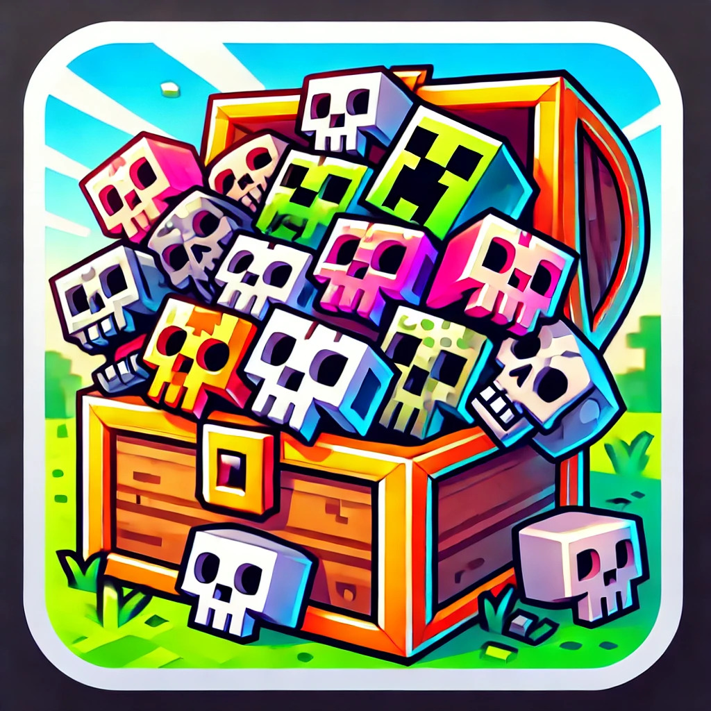

# Headhunters Minecraft Plugin

  

  

## Description
The **Headhunters** plugin adds a thrilling new challenge to your Minecraft server. Players or teams must collect the heads of every mob in the game, with optional support for mob variants like sheep colors or rabbit types. Compete with others to complete your collection, track your progress, and showcase your hunting prowess with custom skull textures and lore!

The game works with teams. You need to be in a team to earn skulls.

A team needs to have a shrine so that skulls can be rewarded. The skull won't drop when the mob dies, only when a player enters a region around their teams shrine.

## How to Install
**Click the DOWNLOAD PLUGIN button above** 

OR

1. Navigate to the [Releases](https://github.com/joeShuff/Minecraft-Headhunters/releases) page on this repository.
2. Download the latest `.jar` file for the plugin.
3. Place the downloaded `.jar` file into your server's `plugins` folder.
4. Restart or reload your server to activate the plugin.

## How to Get Started
1. Create a team using `/createteam <team_name>` (team names can include spaces).
2. Set your teams shrine using `/setshrine`.
3. Invite others to your team if desired.
4. Start hunting mobs! The plugin will automatically track your progress.

## Commands
Here’s a list of commands available in the Headhunters plugin:

### Team Management
- **`/createteam <team_name>`**: Create a new team.
- **`/invite <player_name>`**: Invite a player to your team.
- **`/leave`**: Leave your current team.
- **`/join <team ID> <player>`**: (Admin) Add a player to a given team ID.
- **`/teams`**: (Admin) view the list of teams and their IDs

### Shrine Management
- **`/setshrine`**: Set your team’s shrine location. Requires confirmation if a shrine is already set.
- **`/setshrine confirm`**: Confirm the new shrine location.

### Progress Tracking
- **`/progress`**: View your team’s collection progress.
- **`/missing <category>`**: List the mobs your team still needs to collect. (Optional category)
- **`/globalprogress`**: See other teams' overall progress (does not show specific heads).

### Skull Management
- **`/resummon`**: Launch a UI to resummon earned skulls
- **`/earn [team_id] <entity_type> <variation>`**: (Admin) Mark a skull as earned for a team.

## Thanks
Special thanks to:
- The **Vanilla Tweaks** team for providing some of the skull textures used in this plugin from their *More Mob Heads* datapack.
- **ChatGPT** for assisting with the development of this plugin and writing much of the base code.

Enjoy the hunt!
